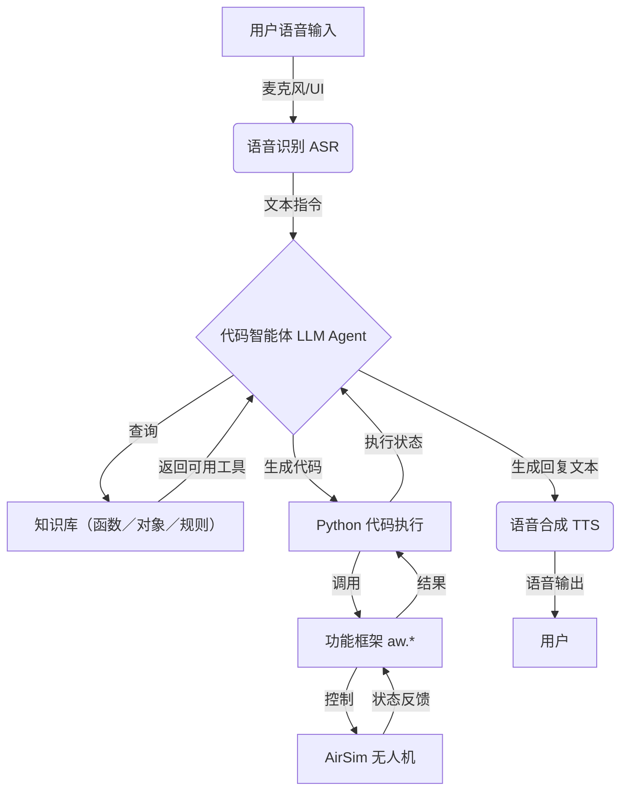

[**Airsim Agent**](https://github.com/maris205/airsim_agent)来源于微软开源项目[**PromptCraft-Robotics**](https://github.com/microsoft/PromptCraft-Robotics) ，提供了由大模型驱动机器人的解决方案。

## 1. Airsim安装、编译和使用尝试
### 1.1 开发环境与编译平台建议

- 硬件/系统

  - 建议 ≥16GB 内存；Windows 11 优先。Mac/Linux 需自行编译 AirSim。

- Python 与工具

  - 使用 conda 与 JupyterLab，IDE 推荐 PyCharm

  - 创建/启用环境与安装：

```bash
conda create -n airsim_agent python=3.10
conda activate airsim_agent
pip install jupyterlab
```

  - 克隆本仓库后，用 PyCharm 打开项目根目录。

- 大模型 API

  - 任选兼容 OpenAI SDK 的平台（如火山方舟、阿里云、腾讯云等）。

- 依赖冲突提示

  - AirSim 的 tornado 与 JupyterLab 可能冲突，不建议 `pip install airsim`。

  - 采用本地包引入：

```python
import sys
sys.path.append('../external-libraries')  # 或绝对路径
import airsim
```

- 编译与平台建议

  - Windows：优先使用现成可执行场景（无需源码编译），上手最快。
  - Linux/macOS：按官方文档编译 AirSim 与 UE 插件，或参考 UE5 社区分支（如 Cosys-AirSim、Colosseum）以适配新平台。

  - 文档参考：`https://github.com/Microsoft/AirSim/blob/main/docs/`
  
### 1.2 AirSim 仿真场景搭建

- 简介：基于 Unreal Engine，支持无人机/车辆与多传感器，适配 HIL/SIL；适合数据生成与高风险场景复现。

- 现状：官方仓库已归档但可用；可参考 UE5 社区分支（Cosys-AirSim、Colosseum）。

- 推荐场景：论文《ChatGPT for Robotics: Design Principles and Model Abilities》配套环境

  - 下载：`https://github.com/microsoft/PromptCraft-Robotics/releases/tag/1.0.0`

  - 解压后直接运行，适合快速上手。

- 参考链接

  - Releases：`https://github.com/microsoft/airsim/releases`

  - 文档：`https://microsoft.github.io/AirSim/`
  
### 1.3 无人机基本控制

- 连接与初始化

```python
import sys
sys.path.append'../external-libraries')
import airsim

client = airsim.MultirotorClient()  # ip 不写是本地
client.confirmConnection()
client.enableApiControl(True)
client.armDisarm(True)
```

- 起降与轨迹

```python
client.takeoffAsync().join()
client.moveToZAsync(-3, 1).join()                      # NED 坐标，Z 负向为上
client.moveToPositionAsync(5, 0, -3, 1).join()         # 航点飞行
client.moveOnPathAsync([airsim.Vector3r(5,0,-3), ...], 1).join()
client.landAsync().join()
client.armDisarm(False)
client.enableApiControl(False)
```

- 状态获取对比

  - `simGetVehiclePose()`：传感器级位姿，可能含噪声；拟真。

  - `simGetGroundTruthKinematics()`：物理引擎真值（含速度/加速度）；用于控制/验证。

- 注意事项

  - 异步 API 多为 `...Async()`，需 `.join()` 串联确保动作顺序。

  - 坐标系为 NED：`moveToZAsync(-3, ...)` 表示上升到 3 米（Z 取负）。
  
### 1.4 视觉感知与图像采集

- 相机与类型

  - 位置：`front_center`/`front_right`/`front_left`/`bottom_center`/`back_center`（兼容旧 ID `"0"~"4"`)。

  - 类型：`Scene`、`DepthPlanar`、`DepthPerspective`、`DepthVis`、`Segmentation`、`SurfaceNormals`、`Infrared` 等。

- 采集示例（OpenCV + Matplotlib）

```python
import cv2, time, numpy as np, matplotlib.pyplot as plt
from airsim import ImageType

client = airsim.MultirotorClient(); client.confirmConnection()
client.enableApiControl(True); client.armDisarm(True)
client.takeoffAsync().join()

camera_name = '0'                 # 或 'front_center'
image_type = ImageType.Scene
resp = client.simGetImage(camera_name, image_type)
if resp:
      img_bgr = cv2.imdecode(np.frombuffer(resp, np.uint8), cv2.IMREAD_UNCHANGED)
      img_rgb = cv2.cvtColor(img_bgr, cv2.COLOR_BGR2RGB)
      plt.imshow(img_rgb); plt.axis('off'); plt.show()

client.landAsync().join()
client.armDisarm(False); client.enableApiControl(False)
```

- 注意事项

  - 并发：多线程/多进程均可，但每个线程/进程需独立创建 `MultirotorClient`，不可共享。

  - 显示：Notebook 用 Matplotlib；桌面窗口显示可用 `a_cv2_imshow_thread`。
  
### 1.5 多无人机控制

- 多机配置

  - 将 `1-airsim_basic/settings.json` 复制为：

    - Windows：`C:\Users\<用户名>\Documents\AirSim\settings.json`

  - 重启模拟器生效。

- 控制要点

  - 在 API 调用中通过 `vehicle_name="UAV1"`（或 `"UAV2"`, `"UAV3"`）区分不同无人机。

  - 示例（并发起飞/定高）：

```python
client = airsim.MultirotorClient()
for i in range(3):
    name = f"UAV{i+1}"
    client.enableApiControl(True, name)
    client.armDisarm(True, name)
    client.takeoffAsync(vehicle_name=name)

for i in range(3):
    name = f"UAV{i+1}"
    client.moveToZAsync(-3, 1, vehicle_name=name)
```

- 注意事项

  - 名称需与 `settings.json` 保持一致；多机并发建议为每机建立独立控制流程。

  - 协同/编队时注意全局 NED 与机体坐标的转换。
 
### 1.6 快速上手流程

1) conda 创建 `airsim_agent`（Python 3.10），安装 `jupyterlab`。  

2) 克隆[Airsim Agent](https://github.com/maris205/airsim_agent)仓库，打开项目根目录。  

3) 下载 PromptCraft-Robotics 场景并解压运行：`https://github.com/microsoft/PromptCraft-Robotics/releases/tag/1.0.0`  

4) 在 `1-airsim_basic/3-airsim_basic.ipynb` 执行连接/起飞/轨迹/降落。  

5) 在 `1-airsim_basic/4-airsim_camera.ipynb` 采集与显示图像。  

6) 复制 `1-airsim_basic/settings.json` 至用户目录，按需多机控制。
- 

## 2. 指令封装和OpenAI SDK调用
### 2.1 SDK封装设计与规则

- **目标**：将底层 AirSim API 语义化、原子化，便于大模型/自然语言直接调用

- **封装规则**

  - **语义化接口**：内部隐藏 **NED 坐标** 转换，对外使用直观语义（如 `fly_to([x,y,正高度])` 自动处理 Z 符号）

  - **功能原子化**：每个方法只做一件事（如 `takeoff`、`land`、`set_yaw`、`fly_to`）

  - **参数/返回标准化**：统一使用简单类型（如 `get_drone_position()->[x,y,z]`、`get_yaw()->角度`）

  - **异步转同步**：统一 `.join()`，保证顺序执行，减少并发不确定性

  - 异常与缺省：适度重试/返回安全缺省值（如 `get_position` 等待对象可用）

  - **单位一致性**：内部弧度/角度转换，对外一律角度（如 `get_yaw()` 返回“度”）

  - **对象别名映射**：`objects_dict` 统一自然语言到 UE 对象名（如 `"car"->"StaticMeshActor_10"`)

- 对象映射`{"turbine1":"BP_Wind_Turbines_C_1","car":"StaticMeshActor_10","solarpanels":"StaticMeshActor_146",...}`

- 典型方法（节选）

```python
class AirSimWrapper:
    def __init__(self):
        self.client = airsim.MultirotorClient()
        self.client.confirmConnection()
        self.client.enableApiControl(True)
        self.client.armDisarm(True)

    def takeoff(self):
        self.client.takeoffAsync().join()

    def land(self):
        self.client.landAsync().join()

    def fly_to(self, point: list[float]):
        z = -point[2] if point[2] > 0 else point[2]
        self.client.moveToPositionAsync(point[0], point[1], z, 5).join()

    def get_drone_position(self) -> list[float]:
        pose = self.client.simGetVehiclePose()
        return [pose.position.x_val, pose.position.y_val, pose.position.z_val]

    def set_yaw(self, yaw_degree: float):
        self.client.rotateToYawAsync(yaw_degree, 5).join()
```

- **注意事项**

  - **NED 坐标统一语义**：向上飞 Z 减小；封装中已处理，外部仅关注“正高度”表达

  - **顺序控制**：连续动作务必 `.join()`；复杂流程拆小步更稳健

### 2.2 OpenAI 等 SDK 调用

- **客户端初始化（OpenAI 协议兼容，含国产云）**

```python
import os
from openai import OpenAI

API_KEY = os.getenv("ARK_API_KEY")
client = OpenAI(
    base_url="https://ark.cn-beijing.volces.com/api/v3",
    api_key=API_KEY,
)
```

- 非流式调用示例

```python
completion = client.chat.completions.create(
    model="doubao-1-5-pro-32k-250115",
    messages=[{"role":"user","content":"常见无人机仿真系统有哪些？"}],
    temperature=0.1,
)
print(completion.choices[0].message.content)
```

- **角色与多轮对话**

  - **`system`**：设定身份/约束（如仅输出 Python 代码块）

  - **`assistant`**：历史回复纳入 `messages` 维护上下文

  - **截断策略**：`messages = chat_history[-10:]` 控制 Token 消耗

- **代码片段抽取**

```python
import re
def extract_python_code(content: str) -> str|None:
    blocks = re.findall(r"```(.*?)```", content, flags=re.DOTALL)
    if not blocks: return None
    code = "\n".join(blocks)
    return code[7:] if code.startswith("python") else code
```

- **参数建议与注意**

  - **temperature** 低值（0.1~0.3）更稳健；配合 **max_tokens** 控制成本；必要时 **top_p** 微调多样性

  - **密钥安全**：使用环境变量；避免明文

  - **长对话优化**：定期截断/摘要，降低成本与延迟

  - 错误处理：区分 API 错误/限流并退避重试

### 2.3 提示词工程与函数调用

- **核心做法**

  - **结构化提示**：角色设定（system）+ 能力边界 + **输出格式约束（仅代码块）**

  - **函数白名单**：明确可调用函数/参数/返回，降低幻觉与越权

  - 错误模板：参数校验/错误码标准化返回，便于自动化处理

- 函数描述模板（简版）

```text
aw.takeoff() - 起飞无人机
aw.land() - 无人机着陆
aw.get_drone_position() -> [x,y,z]
aw.fly_to([x,y,z]) - 飞到目标点（NED 已封装）
aw.get_position(object_name) -> [x,y,z]
```

- 方式对比（要点）

  - Prompt 直控：**快、灵活**，但易失控

  - Function Calling：**可控性强、工程化好**，需前期函数设计

  - MCP：多模型/多工具协作标准化，复杂度更高

### 2.4 知识库构建

- **目录与角色**

  - **`system_prompts/`**：系统级角色设定（行为边界、输出格式、可用库、禁止事项）

  - **`prompts/`**：领域知识/功能清单（函数白名单、对象名称映射、坐标与运动语义、示例）

- **内容关键点**

  - **角色设定**：仅输出 Python 代码块；允许 `math`、`numpy`；使用已定义的 `aw` 对象

  - **函数白名单**：列出 `aw.takeoff/land/fly_to/get_position/get_drone_position/set_yaw/...` 的参数与返回

  - **对象映射**：提供“中文目标名 ↔ 英文内部名”（与 `objects_dict` 同步），如“汽车 ↔ car”

  - **坐标语义**：声明 **NED** 规则与“向上/Z 减小”的高度表达；给出相对运动示例（YZ 平面、三角函数）

  - **输出格式**：仅代码块，或“代码 + 一句话用途说明”

  - **风控约束**：禁止文件/网络/系统命令；只调用白名单函数

- **示例（节选，`prompts/aisim_lession24.txt`）**

```text
以下函数可用：
aw.takeoff()；aw.land()；aw.get_drone_position()->[x,y,z]；
aw.fly_to([x,y,z])；aw.get_position(object_name)->[x,y,z]；aw.set_yaw(yaw_deg)

对象映射（中文→英文）：
汽车→car；风力发电机1→turbine1；太阳能电池板→solarpanels；塔1→tower1 …

坐标/运动规则：
使用 NED；向上飞 Z 减小；YZ 平面相对位移可用三角函数计算

输出格式：
```

```python
aw.takeoff()
```

- **加载方式**

  - `AirSimAgent(knowledge_prompt="prompts/aisim_lession24.txt", system_prompts="system_prompts/airsim_basic_cn.txt")`

  - 更新知识库后，重新初始化 `AirSimAgent` 生效

- **编写建议**

  - **精炼**：避免冗长描述，控制在数百行内，降低 Token 压力

  - **可维护**：分文件管理场景/任务；统一对象命名与坐标规则

  - **一致性**：与 `airsim_wrapper.py` 方法签名、`objects_dict` 保持一致

### 2.4 基本飞行控制示例

- **Agent 封装（`airsim_agent.py`）**

```python
from openai import OpenAI

class AirSimAgent:
    def __init__(self, system_prompts="system_prompts/airsim_basic_cn.txt",
                   knowledge_prompt="prompts/aisim_basic_cn.txt", chat_history=None):
        self.client = OpenAI(base_url="https://ark.cn-beijing.volces.com/api/v3", api_key=API_KEY)
        self.chat_history = []
        # 省略：载入 system 与知识库提示

    def ask(self, prompt: str) -> str:
        # 省略：构造 messages 并调用 chat.completions.create
        ...

    def extract_python_code(self, content: str) -> str|None:
        # 同上文
        ...

    def process(self, command: str, run_python_code=False) -> str|None:
        resp = self.ask(command)
        code = self.extract_python_code(resp)
        if run_python_code and code:
            exec(code)
        return code
```

- **飞到汽车上方（示例）**

```python
car_pos = aw.get_position("car")
target = [car_pos[0], car_pos[1], car_pos[2] - 3]  # NED：上方 3m -> Z 减小
aw.fly_to(target)
```

- **注意事项**

  - 知识库中声明 **对象中英映射** 与 **NED 规则**

  - 执行模式可切换：**调试（只生成）/实操（生成并执行）**

### 2.5 复杂指令：风力发电机检查

- **任务模式**

  - 单步指令 + 等待下一步（人工在回路）、简单 Workflow、Agent 自主执行

- **典型步骤**

  - 靠近 `turbine1`/`turbine2`，沿 X 轴保持距离；设置高度（**Z 为负表示上方**）

  - 叶片检查：上/右下/左下等相对位移，使用三角函数在 **YZ 平面** 规划

  - 机头朝向：`set_yaw(角度)`

- **注意事项**

  - **相同类型对象需澄清**（两台涡轮机、三座塔）；未指明时请求澄清，避免假设

  - 始终以 **NED** 为基准描述相对运动，确保高度/方向一致性

### 2.6 完整任务：太阳能发电矩阵巡检

- **目标**：在阵列上方 **5m** 执行“**割草机**”航迹（蛇形扫掠），覆盖 **10 行**

- 关键设定

  - 面板宽 30m（X）、长 50m（Y），按长度分 10 行

  - 规则：行末换向，右端下移一行再左扫；左端下移一行再右扫，直到完成

- **示例要点**

  - 基于当前位置，明确“向右/向左/向前/向后”的坐标增减规则（在知识库中定义）

  - 保持 **恒定高度 5m（NED：Z 固定为 -5）**

- 注意事项

  - 逐段生成与执行更稳健：便于监控、容错与现场修订

  - 若引入视觉/定位闭环，可在入列/行末对齐处加入校正点
  
## 3. 思考：历史对话数据处理的可能性
### 3.1 目标与约束

- **目标**：在保证无人机控制上下文正确性的前提下，尽量减少对话上下文体积，提升响应速度与吞吐。

- **约束**：AirSim 场景知识与 API 清单相对稳定，宜在初始化阶段外置加载，运行期不重复注入。

### 3.2 核心策略

- **上下文最小化**

  - 仅保留最近 K 轮有效对话（如 4~8 轮），并固定保留首条 system。

  - 将长历史进行**状态化摘要**（如 pos、goal、step、alt、yaw 等短键 JSON），以后续请求用“状态+新指令”替代完整历史。

  - **消息归一与去重**：术语固定表达（如“向上飞 Z 减小”），移除重复确认/日志，减少冗余。

  

- **知识外置与结构化输出**

  - 将函数白名单、对象映射、NED 规则等固定知识放入 `system_prompts/` 与 `prompts/`，**仅初始化注入一次**。

  - 强制**仅输出代码块**或**结构化 JSON**，弱化自然语言解释，减少无效 Token。

  - **函数调用优先**：用参数承载上下文，减少长文本描述；统一 `aw.*` 代码风格，压缩差异化开销。

  

- **缓存与执行控制**

  - **会话/跨会话缓存**：对“同指令→同代码”结果命中即复用；将“后空翻/割草机”等常用流程抽为**宏指令**。

  - **分步生成与执行**：长流程拆分多步，降低单次上下文体积与失败成本。

  - **参数与响应控制**：低温度（0.1~0.3）、限制 `max_tokens`，必要时小幅 `top_p`；区分 API 错误/限流并做退避重试。
  
## 4. 大模型知识库构建
### 4.1 通用层级与加载策略

- 分层组织

  - system：角色、能力边界、输出格式、可用库与风控

  - domain：领域知识（函数白名单、对象/概念映射、坐标/规则、任务宏）

- 加载与调用

  - 初始化一次加载 system+domain

  - 运行期仅携带“状态摘要 JSON + 当前指令”

- 输出约束

  - 仅输出代码块/结构化 JSON，参数承载语义

### 4.2 对象/概念映射（静态范式）

```python
# 静态映射（示例）
OBJECTS = {
  "turbine1": "UE_Turbine_A",
  "turbine2": "UE_Turbine_B",
  "solarpanels": "UE_Solar_Array",
  "car": "UE_Car_A",
}

def resolve_position(env, name: str) -> list[float]:
    """根据通用名称解析环境内部对象并返回位姿[x,y,z]"""
    query = OBJECTS[name] + ".*"
    cand = []
    while not cand:
        cand = env.list_objects(query)
    pose = env.get_pose(cand[0])
    return [pose.x, pose.y, pose.z]
```


### 4.3 多模态与语音集成（视觉/ASR/TTS）

#### 视觉：拍图 → VLM

这是最直接的多模态应用，将无人机摄像头捕获的图像交由视觉语言模型（VLM）进行理解，可以用于场景描述、目标清点等任务。
```python
# 视觉：拍图→VLM
img = camera.capture()  # bytes
b64 = base64.b64encode(img).decode()
resp = llm.chat.completions.create(
  model="vision-model",
  messages=[{"role":"user","content":[
    {"type":"text","text":"列出清晰可见目标"},
    {"type":"image_url","image_url":{"url":f"data:image/png;base64,{b64}"}}]}],
  temperature=0.01
)
print(resp.choices[0].message.content)  # 目标列表
```

#### 视觉：深度相机定位

**原理与实现**
在 AirSim 中，我们无需模拟复杂的双目立体匹配，因为其渲染引擎能直接生成像素级的深度图，这极大地简化了定位过程。AirSim 提供两种主要的深度图类型：`DepthPlanar` 和 `DepthPerspective`。
- **`DepthPlanar`**：图中每个像素的值代表该点到相机**投影平面**的垂直距离。

- **`DepthPerspective`**：图中每个像素的值代表该点到相机**光心**（即相机本身）的直线距离。


结合这两种深度图，我们可以精确计算出任何一个像素点相对于相机的三维坐标。具体流程是：

1. 使用目标检测模型（如 GroundingDINO）在彩色图中找到目标的边界框（Bbox）。

2. 取边界框的中心点 `(cx, cy)` 作为目标在图像上的位置。

3. 从 `DepthPlanar` 图中查询 `(cx, cy)` 处的深度值 `d_plane`。

4. 从 `DepthPerspective` 图中查询 `(cx, cy)` 处的深度值 `d_cam`（这即是目标到相机的直线距离）。

5. 利用 `d_plane` 和 `d_cam`，通过三角关系计算出目标相对于相机中心线的偏航角。
```python
# 视觉：单目深度估计 → 距离/角度
scene, depth_planar, depth_persp = sensor.capture_multi()
(xmin,ymin,xmax,ymax) = detect_bbox(scene)
cx, cy = (xmin+xmax)//2, (ymin+ymax)//2
d_plane = depth_planar[cy, cx]; d_cam = depth_persp[cy, cx]
angle = math.degrees(math.acos(max(1e-6, min(1.0, d_plane/max(1e-6, d_cam)))))
angle = -angle if cx < scene.shape[1]/2 else angle
result = {"name": "target", "distance": float(d_cam), "angle_deg": float(angle)}
```

**双目定位原理**
尽管 AirSim 提供了捷径，了解传统的双目定位原理依然重要，因为它在真实世界的机器人中广泛应用。其核心是模拟人类双眼，通过两个有固定间距（**基线 Baseline**）的相机拍摄同一场景。同一物体在左右图像中的水平像素位置差称为**视差 (Disparity)**。物体越近，视差越大。根据相机**焦距 (Focal Length)**、基线和测得的视差，利用公式 `深度 = (焦距 * 基线) / 视差` 即可计算深度。

```python
# 视觉：双目定位（Stereo Localization）
# 假设双目相机参数已知（来自 settings.json 或标定）
FOCAL_LENGTH = 320  # 焦距（像素单位）
BASELINE = 0.25     # 基线，即双目相机间距（米）

# 1. 获取左右相机图像
responses = client.simGetImages([
    airsim.ImageRequest("front_left", airsim.ImageType.Scene),
    airsim.ImageRequest("front_right", airsim.ImageType.Scene)
])
img_left = cv2.imdecode(np.frombuffer(responses[0].image_data_uint8, np.uint8), 1)
img_right = cv2.imdecode(np.frombuffer(responses[1].image_data_uint8, np.uint8), 1)

# 2. 在左图检测目标，获得其中心点 (cx_left, cy)
(xmin, ymin, xmax, ymax) = detect_bbox(img_left)
cx_left, cy = (xmin + xmax) // 2, (ymin + ymax) // 2

# 3. 在右图中找到对应点 (cx_right, cy)（需立体匹配算法）
cx_right = find_corresponding_point(img_left, img_right, (cx_left, cy))

# 4. 计算视差和深度
disparity = cx_left - cx_right
if disparity > 0:
    depth = (FOCAL_LENGTH * BASELINE) / disparity

    # 5. 反算三维坐标 (相对于左相机)
    X = (cx_left - img_left.shape[1] / 2) * depth / FOCAL_LENGTH
    Y = (cy - img_left.shape[0] / 2) * depth / FOCAL_LENGTH
    Z = depth
    result = {"name": "target", "position_relative": [X, Y, Z]}
else:
    result = None
```

## 5. 思考：知识库构建
### 5.1 总览

- 在缺少固定对象映射的真实环境中，可以“感知绑定—语义解析—世界状态内存”为主线贯通知识库与执行体系，确保在对象无先验ID、目标可移动、感知噪声与语义歧义下，仍能稳定、低成本地完成环境交互。

### 5.2 感知

- 目标与方法

  - 检测/分割/多模态检索结合跟踪与 ReID，完成对象发现、连续追踪与在线绑定。

  - 首次出现的实例分配临时 ID（如 car#1），持久化位姿、外观特征与别名。

- 端到端链路

  - 视觉/多模态采集 → 检测（类别/框/特征）→ 跟踪 + ReID（跨帧一致）→ 实例库更新（ID/pose/feature）。
  
### 5.3 语义解析

- 目标与方法

  - 将“离我最近/左边第二个/黄色箱子”等自然表述解析为空间与属性约束（距离、排序、颜色/形状/尺寸/OCR 等）。

  - 基于实例库筛选候选目标，不唯一则返回缩略图或方位距离进行澄清。

- 端到端链路

  - 自然语句 → 约束解析（空间/属性/数量）→ 候选检索与排序 → 歧义澄清（小图/方位距离）→ 最终实例。

### 5.4 世界模型、控制与优化

- 世界状态内存

  - 轻量语义图维护 id、类别、别名、NED 位姿、2D 框、ReID、空间关系（near/left_of），随时间与可见性迭代更新与清理。

- 控制链路

  - 最终实例位姿 → 动作 API（aw.*）→ 执行结果（位姿/成功态/异常）回写内存，形成“感知-控制”闭环。

- 工程化优化

  - 知识外置与一次加载：固定规则/术语/动作 API 在初始化注入；请求仅携带状态摘要 JSON（pos/goal/step/alt/yaw）与当次指令。

  - 输出结构化：仅代码或 JSON，低温度与 max_tokens 控制长度；函数调用优先，用参数承载语义。

  - 复用与拆解：常见序列宏与缓存复用；长流程拆步执行；图片/日志采用缩略或哈希减少上下文。

  - 治理与安全：版本化与一致性校验、异常路径与回退策略、权限与密钥安全（环境变量/脱敏日志）、可观测埋点闭环优化。

  
### 5.5 最小实现示例

```python
# 感知与实例化
dets = detect("wind turbine, car, tower")            # [{cls,bbox,feat,pose?}, ...]
tracks = tracker.update(dets)                        # [{cls,reid,pose}, ...]

# 在线绑定（首次见面分配实例ID）
for t in tracks:
    if t.reid not in memory:
        num = sum(v["cls"] == t.cls for v in memory.values()) + 1
        memory[t.reid] = {"id": f"{t.cls}#{num}", "cls": t.cls, "pose": t.pose,
                          "aliases": [], "last_seen": now()}

# 指令解析为约束
cons = parse_constraints("左边第二个风机，上方3米")   # {"cls":"wind_turbine","order":"left@2","offset":{"z":-3}}

# 实例选择或澄清
cand = select(memory, cons)                          # 结合方位/距离/外观筛选
if len(cand) != 1:
    ask_user_disambiguation(preview(cand))           # 附缩略图/距离/方位
else:
    p = cand[0]["pose"]
    aw.fly_to([p.x, p.y, p.z - 3])                   # NED：上方3m
```

### 5.6 世界状态内存示例

```json
{
  "id": "car#1",
  "class": "car",
  "name_aliases": ["汽车", "那辆红色车"],
  "pose_ned": [12.0, -3.5, -1.2],
  "bbox_2d": [100, 200, 240, 360],
  "reid": "2f91...c8",
  "last_seen": 1736390000,
  "relations": {"near": ["tower#1"], "left_of": ["turbine#1"]}
}
```


## 6. 基于功能框架自动构建知识库
### 6.1 思路与范式

- **代码即知识（Code as Knowledge）**

  - 手工维护知识库与代码同步易出错且低效。核心范式是**将功能代码本身作为唯一真实源（Single Source of Truth）**，知识库应从此自动生成。

- **自动化构建流程**

  - **装饰器标记**：以 `@tool` 等装饰器标记需暴露给大模型的函数，作为自动化扫描的入口。

  - **静态/动态解析**：通过代码内省（Introspection）或静态分析，提取函数签名、Type Hint、结构化文档字符串（Docstrings）与对象映射字典。

  - **模板化生成**：将解析出的结构化信息填入预设的 Markdown 模板，生成最终的 `SYSTEM_PROMPT` 与 `KNOWLEDGE_PROMPT`。

### 6.2 自动化实现示例

- **第一步：规范化功能代码（`airsim_smol_wrapper.py` 的范式）**

  - 使用 `@tool` 装饰器、类型提示和结构化文档字符串。

```python
# smolagents 的 @tool 或自定义装饰器
from smolagents import tool
from typing import Tuple

# 对象映射字典
objects_dict = {
    "可乐": "airsim_coca",
    "小鸭子": "airsim_duck",
}

@tool
def get_position(object_name: str) -> Tuple[float, float, float, float]:
    """
    获取指定对象的位置与偏航角。

    Args:
        object_name (str): 需查询的对象名称（中文）。

    Returns:
        Tuple[float, float, float, float]: 包含三维坐标（x,y,z）与偏航角（角度制）的元组。
    """
    # ... 实现代码 ...
    query_string = objects_dict[object_name] + ".*"
    # ...
    return [pose.position.x_val, pose.position.y_val, pose.position.z_val, yaw_degree]

@tool
def fly_to(point: Tuple[float, float, float, float]) -> str:
    """
    控制无人机飞至目标点。

    Args:
        point (Tuple[float, float, float, float]): 目标点，含三维坐标（x,y,z）与偏航角（角度制）。

    Returns:
        str: 成功状态描述，如 "成功"。
    """
    # ... 实现代码，含 NED 坐标转换 ...
    return "成功"
```

- **第二步：编写知识库生成脚本（`generate_kb.py`）**

  - 使用 `inspect` 解析模块，`docstring_parser` 解析文档。
```python
import inspect
import docstring_parser
import airsim_smol_wrapper as tools_module # 导入功能模块

def build_knowledge_base():
    functions_info = []
    # 遍历模块成员
    for name, member in inspect.getmembers(tools_module):
        # 检查是否为被 @tool 装饰的函数
        if inspect.isfunction(member) and hasattr(member, '_is_tool'):
            # 解析函数签名与文档
            sig = inspect.signature(member)
            docstring = docstring_parser.parse(member.__doc__)

            # 提取信息
            params = [f"{p.name}: {p.annotation}" for p in sig.parameters.values()]
            func_info = {
                "name": name,
                "params_str": ", ".join(params),
                "return_type": sig.return_annotation,
                "description": docstring.short_description,
                "args": [{"name": p.arg_name, "desc": p.description} for p in docstring.params]
            }
            functions_info.append(func_info)

    # 读取对象映射
    object_mapping = tools_module.objects_dict

    # 使用模板生成 Markdown (此处用 f-string 简化)
    kb_md = "## 可用函数\n\n"
    for func in functions_info:
        kb_md += f"- **{func['name']}**(`{func['params_str']}`) -> `{func['return_type']}`\n"
        kb_md += f"  - **描述**: {func['description']}\n"
        for arg in func['args']:
            kb_md += f"  - **参数** `{arg['name']}`: {arg['desc']}\n"
    kb_md += "\n## 对象映射（中文→内部名）\n\n"
    for key, value in object_mapping.items():
        kb_md += f"- `{key}` → `{value}`\n"

    # 写入文件
    with open("KNOWLEDGE_BASE.md", "w", encoding="utf-8") as f:
        f.write(kb_md)

if __name__ == "__main__":
    build_knowledge_base()
```

### 6.3 示例输出

```text
## 可用函数
- **get_position**(`object_name: <class 'str'>`) -> `typing.Tuple[float, float, float, float]`

  - **描述**: 获取指定对象的位置与偏航角。

  - **参数** `object_name`: 需查询的对象名称（中文）。
- **fly_to**(`point: typing.Tuple[float, float, float, float]`) -> `<class 'str'>`

  - **描述**: 控制无人机飞至目标点。

  - **参数** `point`: 目标点，含三维坐标（x,y,z）与偏航角（角度制）。
## 对象映射（中文→内部名）
- `可乐` → `airsim_coca`
- `小鸭子` → `airsim_duck`
```

### 6.4 可能性

- **优势**

  - **一致性**：知识库与代码实现**永久同步**，减少人工维护错误。

  - **效率**：新增功能只需按规范编写代码与文档，知识库自动更新。

  - **可扩展性**：轻松管理成百上千个工具，支撑复杂 Agent 框架。

- **展望**

  - **CI/CD 集成**：代码提交时自动运行生成脚本，确保知识库实时更新。

  - **原生 Function Calling**：自动生成符合 OpenAI/LangChain 等框架的 JSON Schema，提升调用效率与准确性。

  - **代码自省**：进一步分析函数体（如 NED 转换逻辑），自动在描述中添加“坐标系已处理”等隐性规则。
  
## 7. 模糊指令与代码智能体（Code agents）
### 7.1 从用户通用语言到精确代码

- **用户的视角**：用户不了解底层代码，倾向于使用高层、模糊的自然语言下达指令。

  - **模糊指令示例**：“找到小鸭子”、“检查一下风力发电机有没有问题”、“飞到太阳能板那边看看”。

- **机器的视角**：功能框架与知识库只接受精确、结构化的函数调用。

  - **精确指令示例**：`aw.fly_to([10.5, -3.2, -5.0])`、`aw.detect("duck")`。

- **核心矛盾**：如何将用户的模糊意图，自动翻译并分解为一系列精确、有序的原子操作（函数调用）集合。

### 7.2 代码智能体的多步推理与规划

- **代码智能体 (Code Agent)**：一个以大模型为核心的系统，它能理解自然语言，查询知识库，选择并编排工具（函数），生成并执行代码来完成复杂任务。

- **核心流程：分解模糊命令为精确指令集**

  1. **意图与实体识别**：解析用户指令，识别核心意图（如“查找”、“检查”、“移动”）和关键实体（“小鸭子”、“风力发电机”、“太阳能板”）。

  2. **知识库查询与工具选择**：基于识别出的意图和实体，在知识库中检索最匹配的可用函数/工具。

     - “查找” → 匹配到 `look()`、`detect()`、`ob_objects()`

     - “小鸭子” → 匹配到对象映射 `小鸭子: airsim_duck`

  3. **任务分解与规划（宏组合）**：当单一工具无法完成任务时，Agent 需将模糊指令分解为一系列有序的、可执行的原子步骤。

     - 这是将复杂命令分解为“宏组合”的关键，Agent 在此充当了任务规划师。

  4. **代码生成与执行**：将规划好的步骤序列，翻译成符合知识库规范的 Python 代码，并按需执行。

  5. **结果观察与迭代**：执行代码后，观察返回结果。如果任务未完成（如未找到目标），则基于新状态重新规划，形成闭环。

### 7.3 示例1：分解模糊指令（“找到小鸭子”）

- **用户指令**：“找到小鸭子”

- **Agent 的推理与规划

  1. **意图/实体**：`意图=找到`，`实体=小鸭子`。

  2. **知识库查询**：我知道 `小鸭子` 对应 `duck`。我有 `detect(object_names)` 工具可以检测目标，`turn_left()` 和 `turn_right()` 可以改变朝向。

  3. **任务分解（宏组合）**

     - *Plan A:原地旋转搜索*

       - (a) 以当前位置为中心，向左旋转 30 度。

       - (b) 调用 `detect("duck")` 查看是否在视野内。

       - (c) 如果检测到，记录其位置信息，任务成功。

       - (d) 如果未检测到，重复 (a) 和 (b) 直到旋转一圈。

       - (e) 如果一圈后仍未找到，报告“在当前位置未找到目标”。

  4. **代码生成**

```python
# Agent 生成并执行的代码
duck_found = False
for _ in range(12): # 360/30 = 12 steps
    aw.turn_left(30) # 假设 aw.turn_left() 已封装
    time.sleep(1) # 等待姿态稳定
    # 调用视觉检测工具
    detected_objects, locations = aw.detect("duck")
    if "duck" in detected_objects:
        print(f"找到小鸭子，位置信息: {locations[0]}")
        duck_found = True
        break

if not duck_found:
    print("在当前位置附近未找到小鸭子。")
```

### 7.4 示例2：分解复杂指令

- **用户指令**：“飞过去检查一下第一个风力发电机”

- **Agent 的推理与规划**

  1. **意图/实体**：`意图=检查`，`实体=第一个风力发电机`。

  2. **知识库查询**：`第一个风力发电机` 映射到 `turbine1`。`检查` 是个复杂动作，没有直接对应的工具。但我有 `get_position()` 和 `fly_path()`。我可以规划一个环绕飞行的路径来实现“检查”。

  3. **任务分解（宏组合）**

     - (a) 调用 `get_position("turbine1")` 获取目标中心点 `(cx, cy, cz)`。

     - (b) 定义一个环绕半径（如 15 米）和检查高度（如目标高度）。

     - (c) 在目标点周围生成一个由多个航点组成的圆形或方形路径。

     - (d) 调用 `fly_to()` 飞到第一个航点。

     - (e) 调用 `fly_path()` 按顺序飞越所有航点，完成环绕检查。

     - (f) (可选) 在飞行过程中，周期性调用 `watch("详细描述叶片状态")` 进行多模态观察。

  4. **代码生成**

```python
# Agent 生成并执行的代码
import math

# Step a: 获取目标位置
target_pos = aw.get_position("turbine1")
cx, cy, cz = target_pos[0], target_pos[1], target_pos[2]

# Step b & c: 生成环绕路径
radius = 15.0
height = cz - 20 # 假设在目标上方20米检查
waypoints = []
for i in range(8): # 8个航点
    angle = math.radians(i * 45) # 45度间隔
    x = cx + radius * math.cos(angle)
    y = cy + radius * math.sin(angle)
    waypoints.append(airsim.Vector3r(x, y, height))

# Step d & e: 执行飞行
aw.fly_to(waypoints[0])
aw.fly_path(waypoints + [waypoints[0]]) # 飞一圈并回到起点

print("已完成对风力发电机1的环绕检查。")
```

### 7.5 代码智能体的价值

- **降低使用门槛**：用户无需学习复杂的 API 或编程，用自然语言即可与系统交互。

- **提升任务上限**：通过**任务分解**和**宏组合**，Agent 能完成远超单个工具能力的复杂、多步任务。

- **动态适应性**：通过**观察-规划-执行**的闭环，Agent 能根据环境变化和执行结果调整策略，表现出更高的智能和鲁棒性。

- **框架支持**：`smol-agents`、`LangChain`、`AutoGen` 等框架为此类智能体的构建提供了强大的工程支持，包括工具注册（如 `@tool`）、规划逻辑和执行循环。

## 8. 语音指令
### 8.1 必要性

- **自然与直观**：语音是人类最自然的沟通方式，极大地降低了操作门槛，用户无需学习复杂的编程或遥控器操作。

- **解放双手（Hands-Free）**：在真实作业场景中，操作员可能需要同时处理其他事务或手持设备，语音指令实现了“解放双手”，提升了操作安全性与效率。

- **表达复杂意图**：相比于按钮或摇杆，语言能更灵活地表达复杂、多步骤的任务意图，例如“先飞到那边的太阳能板，然后从左到右扫描一遍”，这背后蕴含了目标识别、路径规划和连续动作。

- **多模态协同**：语音是多模态交互的核心。用户可以结合视觉说出“看看**那个**红色的车”，系统需要融合视觉定位与语音指令才能准确执行，实现更智能的交互。

### 8.3 实现原理与架构

语音指令的端到端实现，是一个整合了**语音处理**、**语言理解**、**任务规划**和**代码执行**的完整链路。本项目核心架构如下：

1.  **语音识别 (ASR - Audio Speech Recognition)**：将用户的原始语音流转换成文本字符串。

2.  **代码智能体 (LLM Agent)**：接收文本指令，作为系统的“大脑”。

3.  **知识库查询与任务规划**：智能体查询已构建的知识库，理解文本指令的意图，并将其分解为一系列精确的、可执行的原子步骤（宏组合）。

4.  **代码生成**：智能体将规划好的步骤序列，生成符合功能框架（如`aw.*`）的Python代码。

5.  **代码执行**：执行生成的代码，通过已封装的`AirSimWrapper`或`smol-agent tools`与无人机仿真环境交互。

6.  **（可选）语音合成 (TTS - Text to Speech)**：将执行结果或需要澄清的问题，合成为语音，向用户播报，形成交互闭环。



### 8.4 案例

```python
from fake.user_app.recognition_module import process_mp3
from fake.five.user_app.voice_module import process_text2mp3
from fake.four.agent_app.airsim_agent import AirSimAgent # 假设使用一个统一的Agent

# --- 初始化 ---
# 1. 初始化代码智能体，加载最全的知识库
#    该知识库应包含飞行控制、多模态视觉工具、对象映射等
print("正在初始化智能体...")
my_agent = AirSimAgent(knowledge_prompt="prompts/knowledge_base_full.txt")

# --- 模拟一次完整的语音交互 ---
# 2. 语音输入 (在真实应用中，这会来自麦克风录音)
#    这里我们使用一个预先录制好的音频文件
audio_file_url = "https://your-online-storage/fly_to_car_and_look.mp3"
print(f"接收到语音指令，正在识别...")

# 3. 语音识别 (ASR)
command_text = process_mp3(audio_file_url)
print(f"识别结果: '{command_text}'")

# 4. (可选) TTS 确认指令
feedback_text = f"收到指令: {command_text}。正在规划..."
process_text2mp3(feedback_text)
# play_audio("feedback.mp3") # 播放确认语音

# 5. 代码智能体处理指令
#    Agent会进行任务分解和代码生成
print("智能体正在处理指令...")
# 设置为 True 以直接执行生成的代码
generated_code = my_agent.process(command_text, run_python_code=True)

print("\n--- 智能体生成的代码 ---")
print(generated_code)
print("------------------------\n")

# 6. (可选) TTS 报告任务结果
#    真实的 Agent 会根据代码执行的返回结果来生成报告
final_report_text = "任务已完成。已到达汽车上方并完成观察。"
process_text2mp3(final_report_text)
# play_audio("report.mp3") # 播放最终报告

print("语音指令流程结束。")

```
