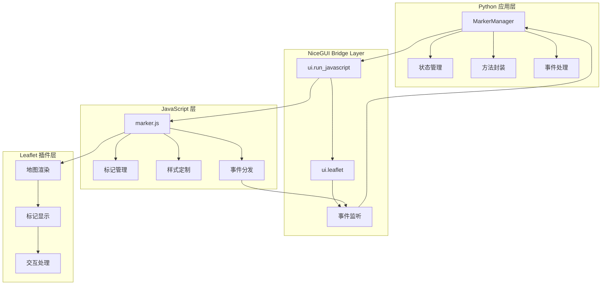
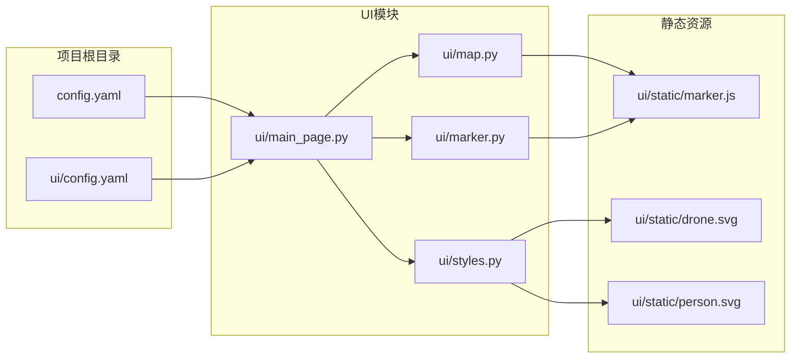
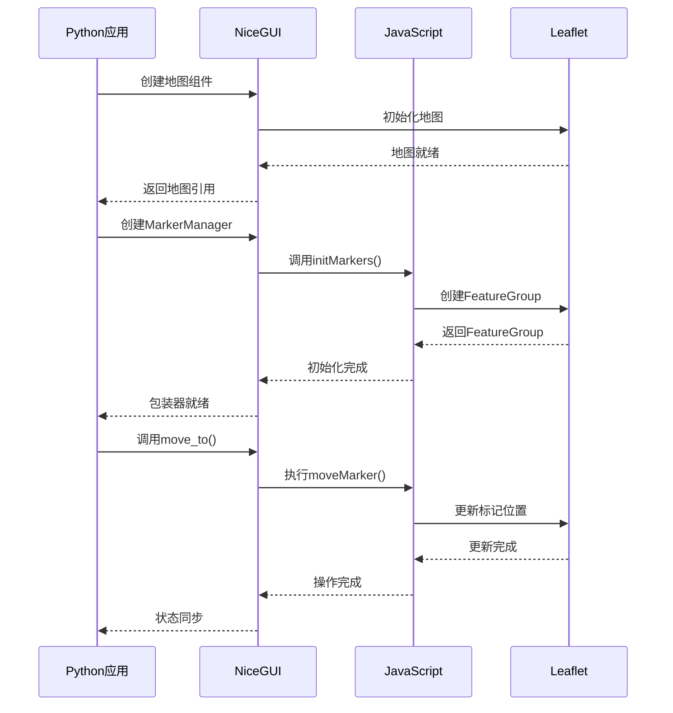
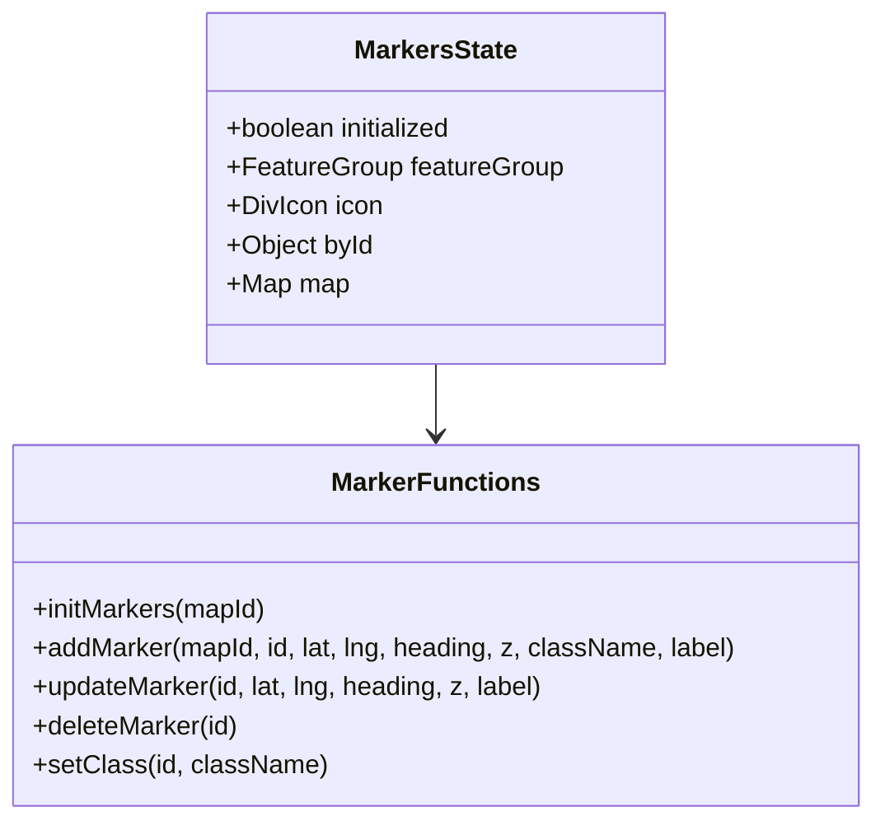
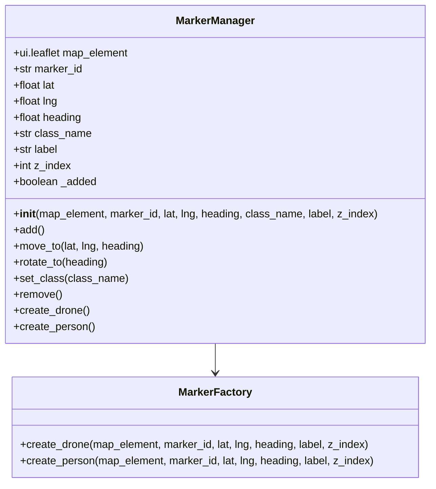
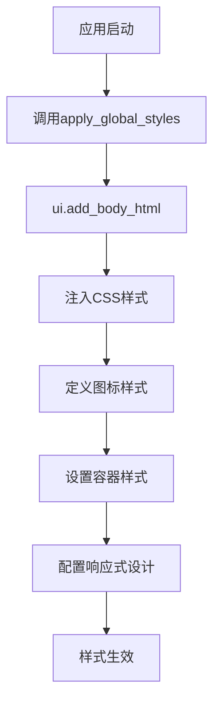
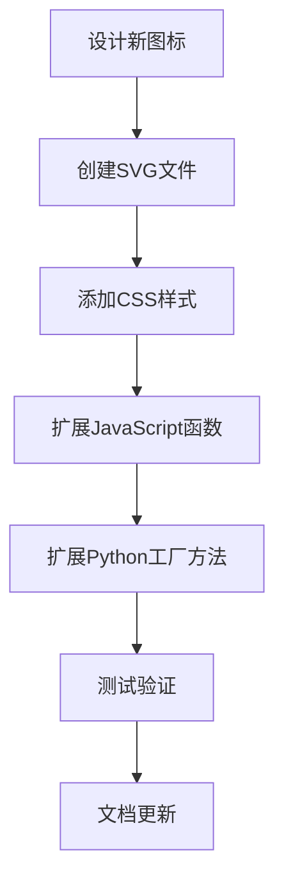
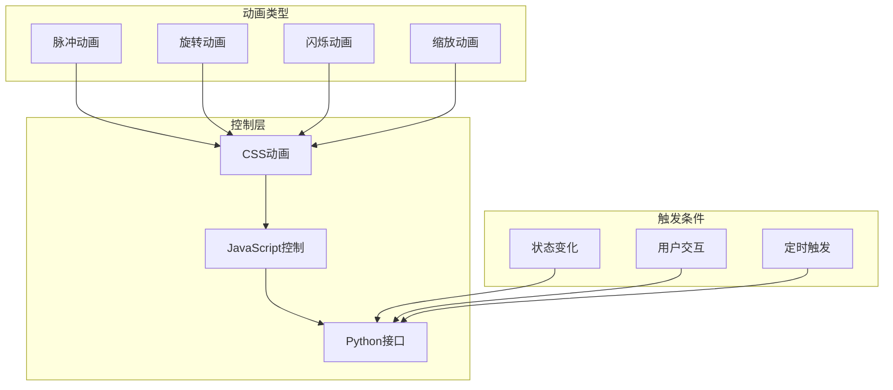
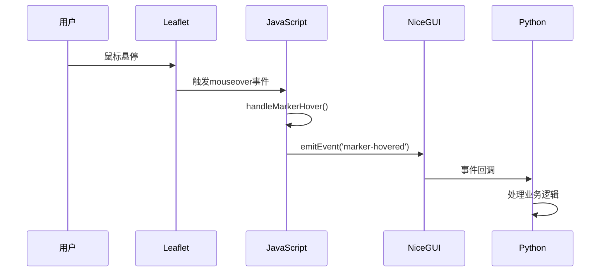
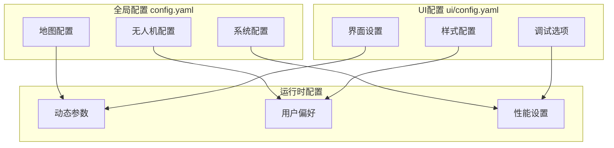

本文档详细描述了在NiceGUI框架中实现JavaScript Bridge架构的方法，该架构通过Python封装JavaScript代码，实现对Leaflet地图插件的样式定制和功能扩展。最终实现了替换NiceGUI中Leaflet标记样式，新增无人机和人的标记，并通过对象管理所有标记。


### 技术栈
- **前端**: NiceGUI + Leaflet + JavaScript
- **后端**: Python
- **通信**: JavaScript Bridge
- **样式**: CSS + SVG图标

## 架构设计

### 整体架构图



### 文件关联关系



### 数据流图



## 核心实现

### JavaScript层实现 (marker.js)

#### 状态管理架构




### Python包装器实现 (marker.py)

#### 类设计架构



### 样式系统实现 (styles.py)

#### 样式注入流程



## 使用示例


### 批量操作示例

```python
# 创建多个标记
markers = {}
for i in range(3):
    marker_id = f"drone_{i:03d}"
    markers[marker_id] = MarkerManager.create_drone(
        map_element=map_element,
        marker_id=marker_id,
        lat=39.9042 + i * 0.001,
        lng=116.4074 + i * 0.001,
        heading=i * 45.0,
        label=f"无人机{i+1}"
    )

# 批量更新
for marker in markers.values():
    marker.move_to(new_lat, new_lng, new_heading)
```

## 扩展性设计

### 新标记类型扩展

#### 扩展流程



#### 样式扩展示例

```css
.target-icon {
    width: 32px;
    height: 32px;
    background-image: url('/static/target.svg');
    background-size: contain;
    background-repeat: no-repeat;
    filter: drop-shadow(0 2px 4px rgba(0,0,0,0.3));
}

.target-icon-animated {
    animation: pulse 2s infinite;
}

@keyframes pulse {
    0% { transform: scale(1); }
    50% { transform: scale(1.1); }
    100% { transform: scale(1); }
}
```

### 动画效果扩展

#### 动画系统架构



### 事件系统扩展

#### 事件流架构



## 配置管理

### 配置层次结构



### 配置示例

```yaml
# config.yaml
map:
  center_lat: 39.9042
  center_lng: 116.4074
  zoom_level: 12
  bing_key: "your_bing_maps_key"

markers:
  default_size: [32, 32]
  default_anchor: [16, 16]
  animation_enabled: true
  batch_update_threshold: 10

# ui/config.yaml
ui:
  mouse_debug_window: false
  marker_animations: true
  performance_mode: false
  
styles:
  drone_icon_size: [32, 32]
  person_icon_size: [28, 28]
  target_icon_size: [24, 24]
```

## 代码段参考

### 1. JavaScript层核心实现 (marker.js)

#### 自定义图标创建
```javascript
function addMarker(mapId, id, lat, lng, heading = 0, z = 0, className = 'drone-icon', label = '') {
    // 创建自定义DivIcon
    var IconCtor = L.DivIcon.extend({ 
        options: { 
            className: className,        // CSS类名控制样式
            iconSize: [32, 32],         // 图标尺寸
            iconAnchor: [16, 16],       // 锚点位置
            popupAnchor: [0, -16],      // 弹窗位置
            html: label                 // 动态标签
        } 
    });
    
    var iconx = new IconCtor();
    var marker = L.marker([lat, lng], {
        icon: iconx,
        zIndexOffset: z,
        rotationAngle: heading,         // 旋转角度
        rotationOrigin: '16px 16px',    // 旋转中心点
    }).addTo(markers.featureGroup);

    marker._id = id;
    markers.byId[id] = marker;
}
```

#### 标记旋转更新
```javascript
function updateMarker(id, lat, lng, heading = null, z = null, label = null) {
    var marker = markers.byId[id];
    if (!marker) return;
    
    if (lat !== null && lng !== null) marker.setLatLng([lat, lng]);
    if (heading !== null && typeof marker.setRotationAngle === 'function') 
        marker.setRotationAngle(heading);  // 更新旋转角度
    if (z !== null) marker.setZIndexOffset(z);
    if (label !== null) {
        // 更新图标标签
        var currentIcon = marker.options.icon;
        var newIcon = L.divIcon({ 
            className: currentIcon.options.className, 
            iconSize: currentIcon.options.iconSize, 
            iconAnchor: currentIcon.options.iconAnchor, 
            popupAnchor: currentIcon.options.popupAnchor, 
            html: label 
        });
        marker.setIcon(newIcon);
    }
}
```

### 2. Python包装器实现 (marker.py)

#### 样式类切换
```python
def set_class(self, class_name: str):
    """切换样式类"""
    self.class_name = class_name
    with self.map_element:
        ui.run_javascript(f"setClass('{self.marker_id}', '{self.class_name}')")

def rotate_to(self, heading: float):
    """仅更新朝向"""
    self.heading = heading
    with self.map_element:
        ui.run_javascript(f"updateMarker('{self.marker_id}', null, null, {self.heading})")
```

#### 工厂方法 - 预设样式
```python
@classmethod
def create_drone(cls, map_element: ui.leaflet, marker_id: str, lat: float, lng: float, 
                 heading: float = 0, label: str = '', z_index: int = 0):
    """创建无人机标记 - 使用drone-icon样式"""
    return cls(map_element, marker_id, lat, lng, heading, 'drone-icon', label, z_index)

@classmethod
def create_person(cls, map_element: ui.leaflet, marker_id: str, lat: float, lng: float, 
                  heading: float = 0, label: str = '', z_index: int = 0):
    """创建人员标记 - 使用person-icon样式"""
    return cls(map_element, marker_id, lat, lng, heading, 'person-icon', label, z_index)
```

### 3. 样式系统实现 (styles.py)

#### 图标样式定义
```python
def apply_global_styles():
    """应用全局样式"""
    ui.add_body_html('''
    <style>
        /* 无人机图标样式 */
        .drone-icon {
            width: 32px;
            height: 32px;
            background-image: url('/static/drone.svg');
            background-size: contain;
            background-repeat: no-repeat;
            filter: drop-shadow(0 2px 4px rgba(0,0,0,0.3));
        }
        
        /* 人员图标样式 */
        .person-icon {
            width: 28px;
            height: 28px;
            background-image: url('/static/person.svg');
            background-size: contain;
            background-repeat: no-repeat;
            filter: drop-shadow(0 2px 4px rgba(0,0,0,0.3));
        }
        
        /* 激活状态样式 */
        .drone-icon-active {
            filter: drop-shadow(0 2px 4px rgba(255,0,0,0.5)) brightness(1.2);
        }
        
        /* 动画效果 */
        .drone-icon-animated {
            animation: pulse 2s infinite;
        }
        
        @keyframes pulse {
            0% { transform: scale(1); }
            50% { transform: scale(1.1); }
            100% { transform: scale(1); }
        }
    </style>
    ''')
```

### 4. 地图组件封装 (map.py)

#### 旋转插件集成
```python
def create_full_page_map(self):
    """创建支持旋转的地图"""
    additional_resources = [
        'https://unpkg.com/leaflet-rotatedmarker@0.2.0/leaflet.rotatedMarker.js',  # 旋转插件
    ]
    
    map_element = ui.leaflet(
        center=[self.center_lat, self.center_lng], 
        zoom=self.zoom_level,
        additional_resources=additional_resources  # 加载旋转插件
    ).classes('map-container')

    return map_element
```

### 5. 使用示例

#### 样式和旋转操作
```python
# 创建带样式的标记
drone = MarkerManager.create_drone(
    map_element=map_element,
    marker_id="drone_001",
    lat=39.9042,
    lng=116.4074,
    heading=45.0,        # 初始朝向
    label="无人机1"
)

# 更新旋转角度
drone.rotate_to(90.0)

# 切换样式类
drone.set_class("drone-icon-active")  # 激活状态
drone.set_class("drone-icon-animated")  # 动画效果
```

### 6. 样式配置

#### 图标尺寸配置
```yaml
styles:
  drone_icon_size: [32, 32]      # 无人机图标尺寸
  person_icon_size: [28, 28]     # 人员图标尺寸
  icon_anchor: [16, 16]          # 图标锚点
  rotation_origin: "16px 16px"   # 旋转中心点
```

## 参考文献

- **[Leaflet Custom Icons Tutorial](https://leafletjs.com/examples/custom-icons/)** - Leaflet 官方自定义图标教程。

- **[NiceGUI Leaflet Documentation](https://nicegui.io/documentation/leaflet)** - NiceGUI 中使用 Leaflet 地图的基础 API 和示例代码。

- **[NiceGUI Leaflet Marker Selection Discussion](https://github.com/zauberzeug/nicegui/discussions/2361)** - 提供了在 NiceGUI 中实现标记点击事件和交互功能的解决方案。

- **[Leaflet Marker Management on Stack Overflow](https://stackoverflow.com/questions/9912145/leaflet-how-to-find-existing-markers-and-delete-markers)**

- **[Leaflet.RotatedMarker Plugin](https://github.com/bbecquet/Leaflet.RotatedMarker)** - 支持标记旋转功能的 Leaflet 插件。