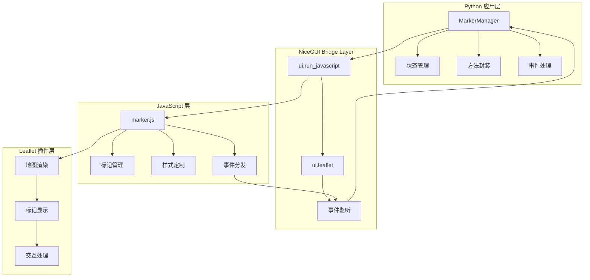
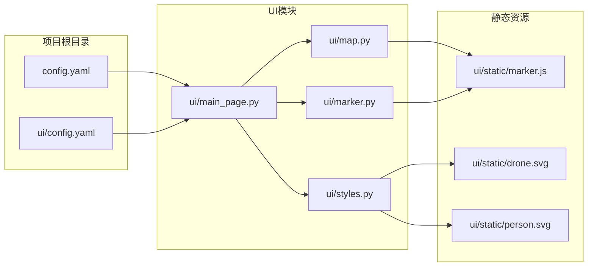
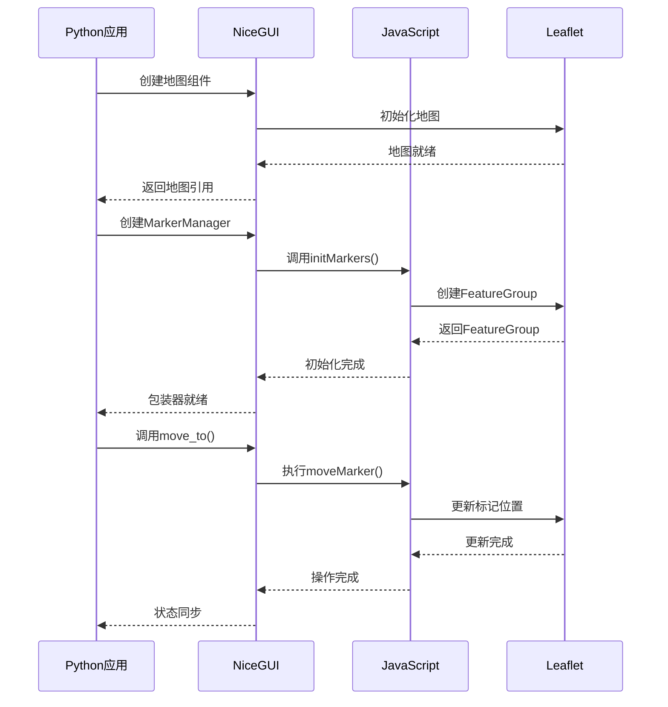
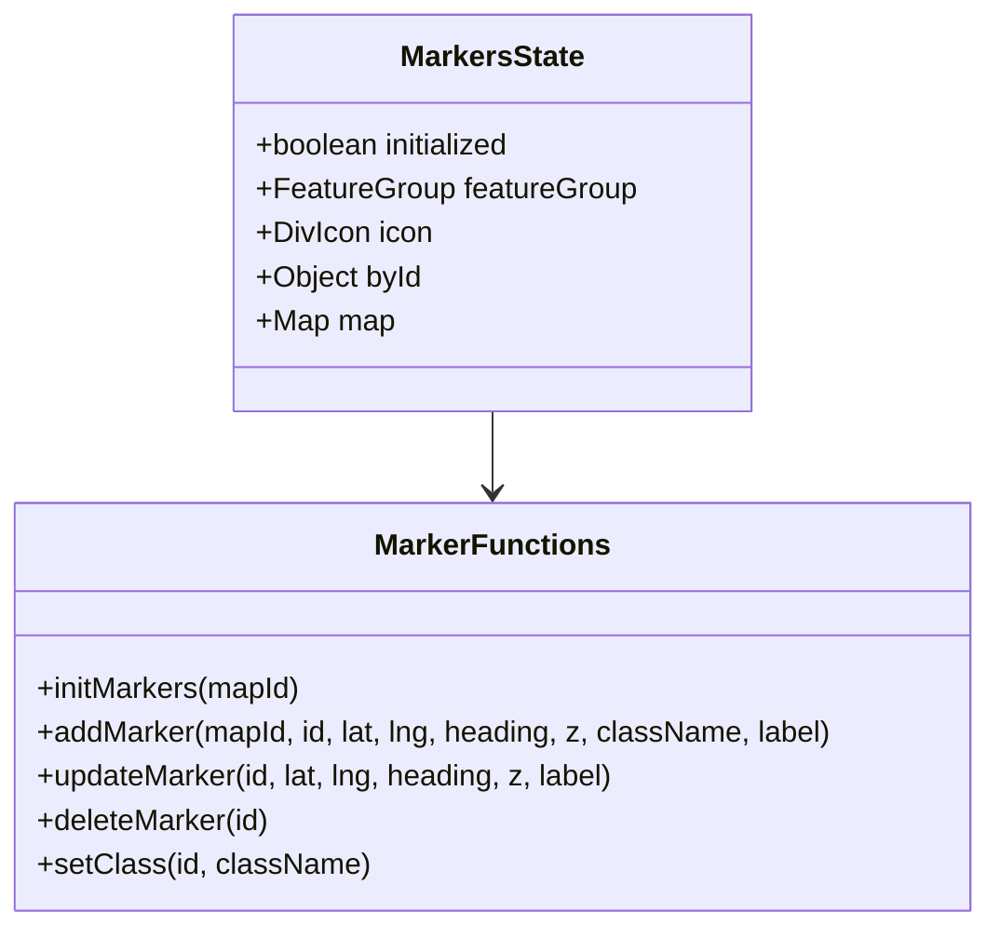

本文档详细描述了在NiceGUI框架中实现JavaScript Bridge架构的方法，该架构通过Python封装JavaScript代码，实现对Leaflet地图插件的样式定制和功能扩展。最终实现了替换NiceGUI中Leaflet标记样式，新增无人机和人的标记，并通过对象管理所有标记。

### 技术栈
- **前端**: NiceGUI + Leaflet + JavaScript
- **后端**: Python
- **通信**: JavaScript Bridge
- **样式**: CSS + SVG图标

## 架构设计

### 整体架构图

### 文件关联关系

### 数据流图

## 核心实现

### JavaScript层实现 (marker.js)

#### 状态管理架构

### Python包装器实现 (marker.py)

...（内容同原文，略） ...

## 使用示例

...（内容同原文，略） ...

## 扩展性设计

...（内容同原文，略） ...

## 参考文档

- [Leaflet Custom Icons Tutorial](https://leafletjs.com/examples/custom-icons/)
- [NiceGUI Leaflet Documentation](https://nicegui.io/documentation/leaflet)
- [NiceGUI Leaflet Marker Selection Discussion](https://github.com/zauberzeug/nicegui/discussions/2361)
- [Leaflet Marker Management on Stack Overflow](https://stackoverflow.com/questions/9912145/leaflet-how-to-find-existing-markers-and-delete-markers)
- [Leaflet.RotatedMarker Plugin](https://github.com/bbecquet/Leaflet.RotatedMarker)
